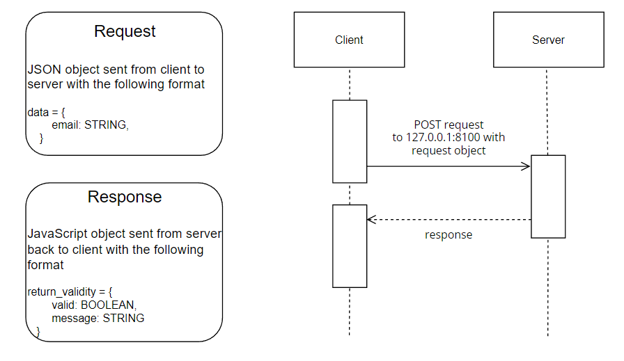

# Email Validator

This microservice takes an email address and validates it as successful or not with relevant error message.

## Description

This application uses Node and Express to validate an email address designated for an account sign-up process. The request is sent to the application as a stringified JSON object and responds with a JavaScript object containing two properties: (1) validity as a boolean and (2) error message (or a blank string if the email is valid). The request is POST and sent to ```/sign-up.``` 

### Request: a JSON Object in the following format:
```
data = {
        email: STRING,
    }
```
* ```email``` takes the user-inputted email address.

### Response: 
```
return_validity = {
        valid: BOOLEAN,
        message: STRING
    }
```
* ```valid``` is false by default. If all validator checks are passed, it is true.
* ```message``` is an empty string by default. If validator checks fail and the email is invalid, it is the error message.

### UML sequence diagram



## Getting Started

### Dependencies

* Node.js v16.14.2

### Installing

* Fork the repository and clone it on your machine.
* In the command line terminal, run:
```
npm install
```
* In ```app.js```, designate the local PORT on which to run the validator.

### Executing program

* Run the command ```node app.js```, to start the application.

## Help

Feel free to contact me for any questions or concerns.

### Variables to change for integration
* In ```app.js```, ensure the local host PORT matches that in ```create_email.js``` on line 40 (```xhttp.open```).
* In ```create_email.js```, ensure the email input form ID on line 13 (```document.getElementById```) matches that in your web page file.
* In ```create_email.js```, ensure the error message div ID on line 14 (```document.getElementById```) matches that in your web page file.

### Example call

## Authors

* [Jonathan Louangrath](https://github.com/jontlo)

## Version History

* 0.1
    * Initial Release

## Acknowledgments

This project was created for Oregon State University's CS_361_400_W2023 course.

* [README template](https://gist.github.com/DomPizzie/7a5ff55ffa9081f2de27c315f5018afc)
* [NodeJS Starter Application](https://github.com/osu-cs340-ecampus/nodejs-starter-app)
* [DOM Manipulation](https://www.w3schools.com/js/js_htmldom_nodes.asp)
* [Email Validator RegEx](https://stackoverflow.com/questions/52456065/how-to-format-and-validate-email-node-js)
